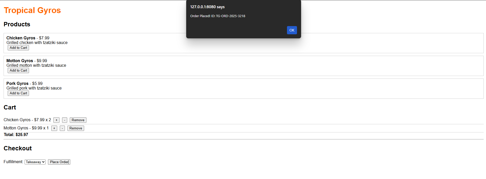

# Tropical Gyros - Mini Order Flow Module

## Tech Stack
- **Backend:** Node.js, Express.js  
- **Database:** MongoDB (Atlas)  
- **Frontend:** Single-page HTML (`index.html`) with embedded JavaScript  
- **Tools:** VS Code, Nodemon, Postman (optional for API testing)

## Developer Details
- **Name:** Arindam Ojha
- **Mobile:** +91 6292293477
- **Email:** arindamojha10@gmail.com
- **LinkedIn:** [linkedin.com/in/arindamojha](https://linkedin.com/in/arindamojha)


## Project Structure
```
tropical-gyros-backend/
├─ models/
│  ├─ Product.js
│  └─ Order.js
├─ routes/
│  ├─ productRoutes.js
│  └─ orderRoutes.js
├─ public/
│  └─ index.html
├─ server.js
└─ package.json
```

## Features

### 1. Product Listing
- API endpoint: `GET /api/products`  
- Displays:
  - Category: Gyros  
  - Product Name, Price, Description  
  - Add to Cart button  

### 2. Cart Management
- Add item to cart  
- Increase / decrease quantity  
- Remove item  
- Show total price  

### 3. Checkout Logic
- Select **Delivery** or **Takeaway**  
- If Delivery, capture:
  - Name, Mobile Number, City, Street/Apartment  
- Calculates total amount automatically  
- Mocked payment method included  

### 4. Order Confirmation
- Generates unique Order ID (`TG-ORD-2025-XXXX`)  
- Stores order details in MongoDB:
  - Items, Total amount, Fulfillment type  
  - Delivery address (if applicable)  
  - Payment method, Order status (`PENDING`)  
- Order ID displayed to user after checkout  

### 5. Backend / Data Design

**Product Schema:**
```js
{
  name: String,
  price: Number,
  description: String,
  category: String
}
```
**Order Schema:**
```js
{
  orderId: String,
  items: [
    { productId, name, price, quantity }
  ],
  totalAmount: Number,
  fulfillmentType: "DELIVERY" | "TAKEAWAY",
  deliveryAddress: { name, mobile, city, street },
  paymentMethod: String,
  status: "PENDING",
  createdAt: Date
}
```

#### Setup & Run

***1. Clone the repository:***
```bash
git clone <your-repo-link>
cd tropical-gyros-backend
```

***2. Install dependencies:***
```
npm install
```
***3. Start the server:***
```
npx nodemon server.js
```
***4. Open public/index.html in a browser to access the frontend***


## API Endpoints

- **GET /api/products**  
  Returns the list of all products.

- **POST /api/orders**  
  Create a new order. Body example:
  ```json
  {
    "items": [
      { "productId": "123", "name": "Chicken Gyros", "price": 7.99, "quantity": 2 }
    ],
    "fulfillmentType": "DELIVERY",
    "deliveryAddress": {
      "name": "Arindam Ojha",
      "mobile": "6292293477",
      "city": "Kolkata",
      "street": "5 lake Place"
    }
  }


2. **Assumptions / Notes** – clarify a few things the evaluator might wonder:  
```markdown
## Assumptions
- Payment is mocked; no real payment integration.  
- Cart is stored in frontend memory; refreshing the page will reset it.  
- Delivery information is optional if "Takeaway" is selected.  
- Product category is fixed as "Gyros" for this assignment.
```


## Frontend Access
Open `public/index.html` in a browser. Make sure the backend server is running at `http://localhost:5000`.


## Screenshots

### image1


### image 2
